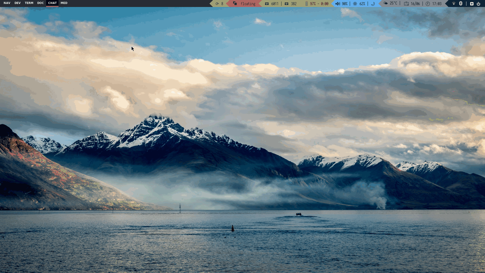
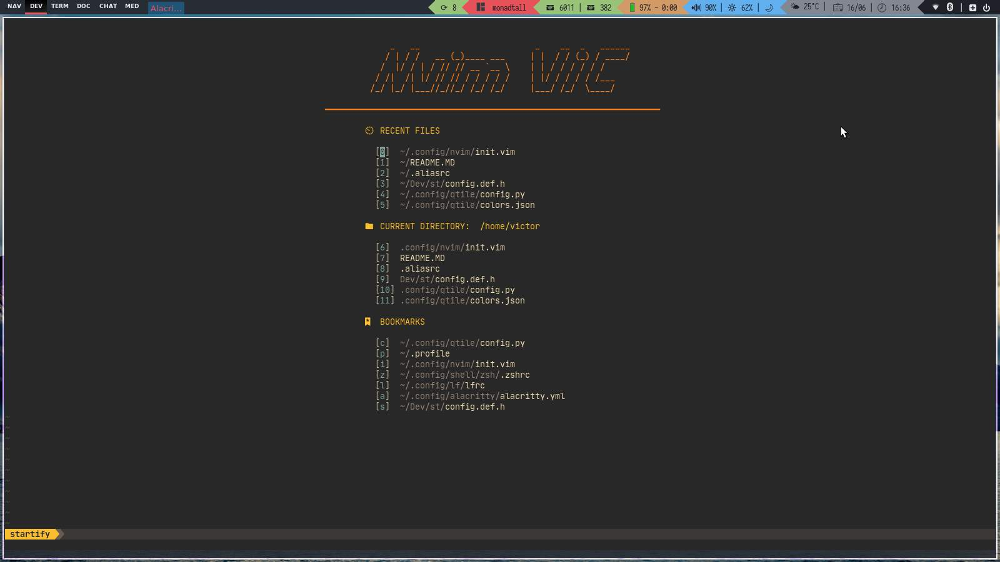
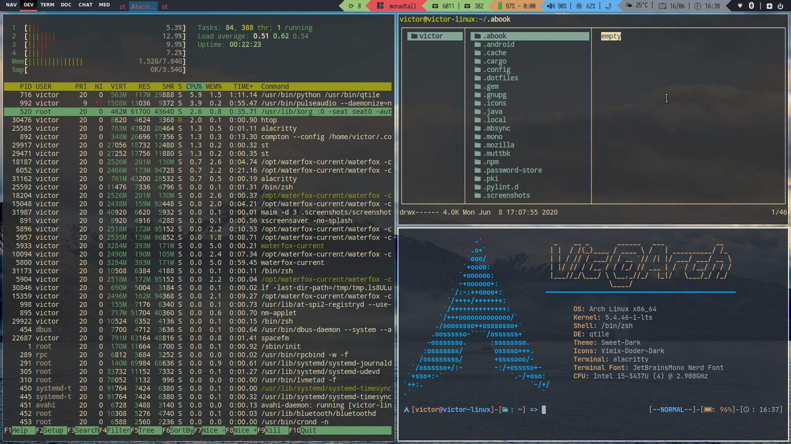
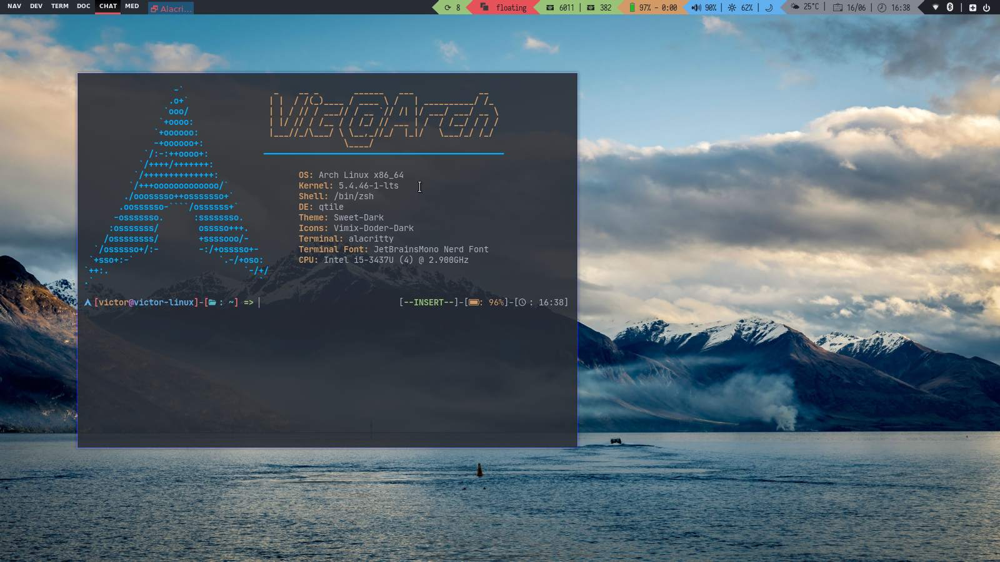
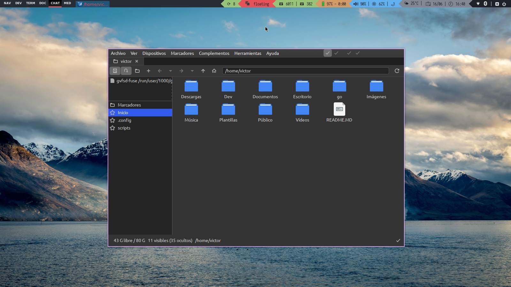

# DOTFILES
Welcome to my personal desktop settings and configuration files

## Features
- **Qtile** tiling window manager with powerline effect and custom widgets
- Notification support using `deadd`
- **Rofi-dmenu** for application menu and other scripts such ash `powermenu` or `dfav` \(See my scripts repo\)
- Using **Neovim** as default text editor with multiple plugins and awesome custom settings
- Using **Lf** as default file manager with a nice customization
- Using **zsh** shell with custom prompt and `select-prompt` function

## Installation
An installation script is in progress. Meanwhile you can get these settings just by coping this repository to your home folder and installing the necessary dependencies.

## Screenshots

